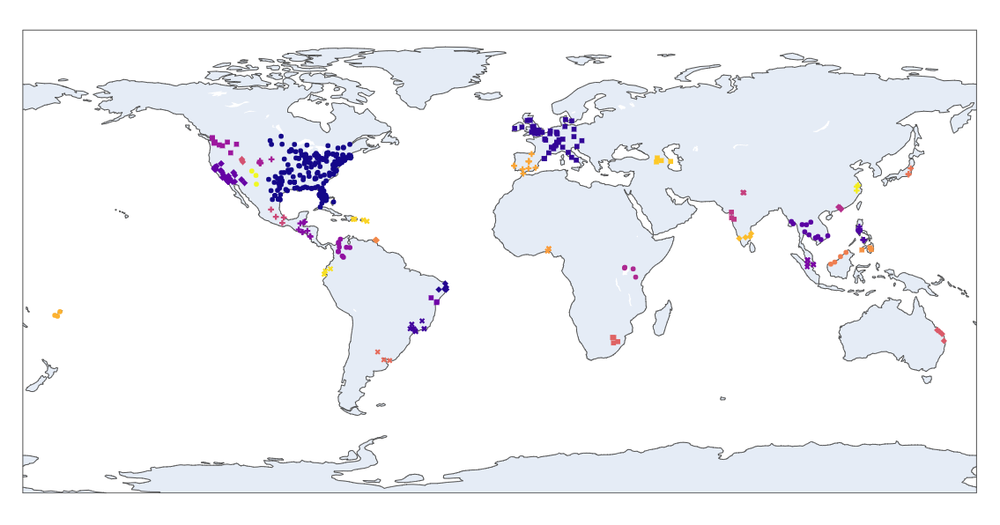

# Tracking down the next Panademic using data

The outbreak of COVID-19 has highlighted the importance of tracking and predicting pandemics in general.In this project, we use text clustering to analyze news data.The goal of this project is to find the next viral Panademic. To achive this we scrap health related news from NewsAPI from all around the world and then using Machine Learning techniques like clustering to find the patterns

